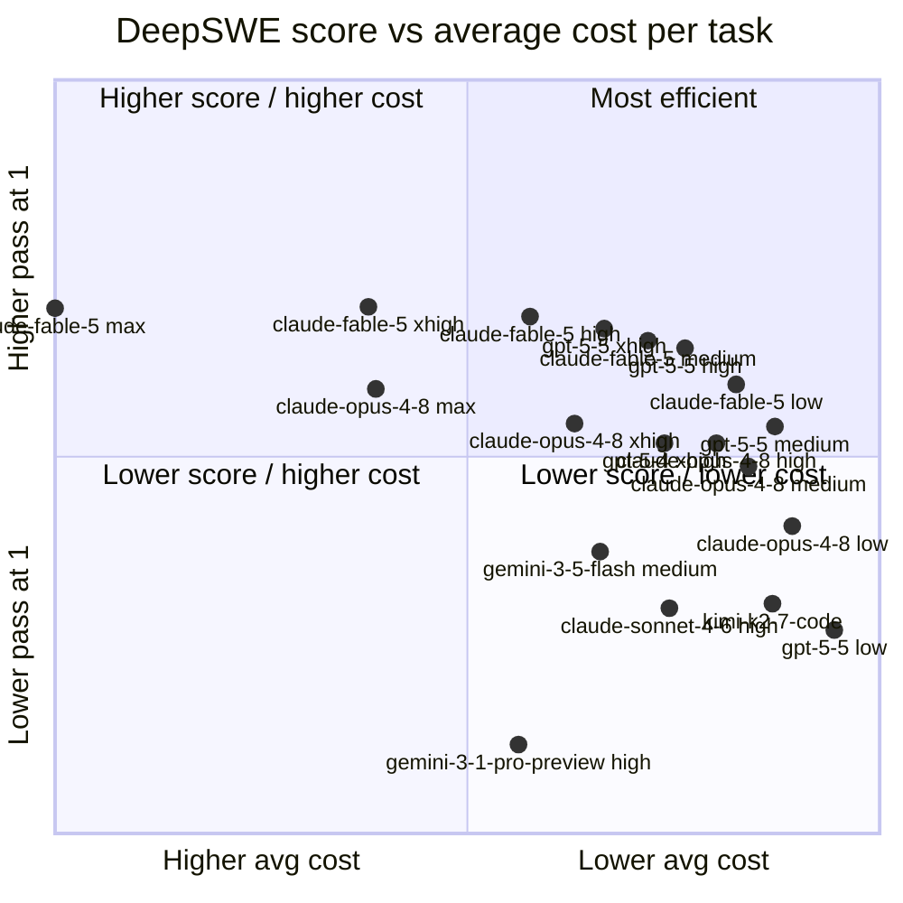
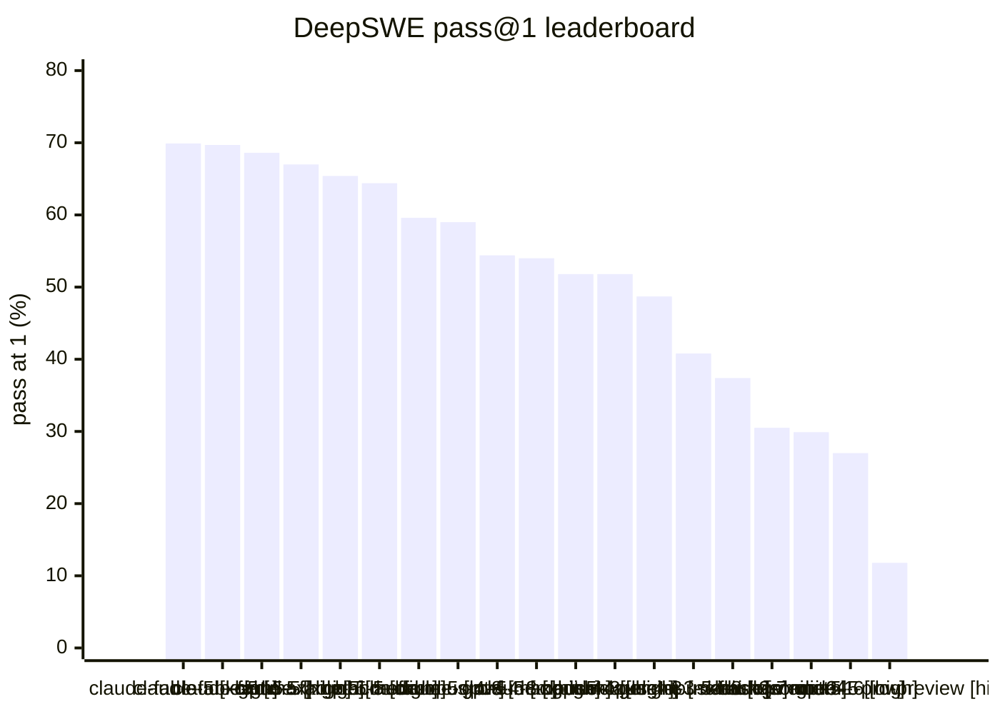

# DeepSWE changelog

This repository tracks changes to the published DeepSWE benchmark results.

> **Original source:** DeepSWE is published by DataCurve at [deepswe.datacurve.ai](https://deepswe.datacurve.ai). Please visit the original site for the canonical benchmark presentation and context.

A scheduled GitHub workflow runs `bun run scrape`, normalizes the public artifact JSON, and commits only when result data changes.

## Charts

### DeepSWE score vs average cost

### pass@1 leaderboard

## Leaderboard

| Model | Config | Effort | Pass@1 | Passed | Attempts | Avg cost | Avg steps |
| --- | --- | --- | --- | --- | --- | --- | --- |
| claude-fable-5 | mini_swe_agent_claude_fable_5_xhigh | xhigh | 69.9% | 316 | 452 | $13.41 | 68.4 |
| claude-fable-5 | mini_swe_agent_claude_fable_5_max | max | 69.7% | 304 | 436 | $21.63 | 88.43 |
| claude-fable-5 | mini_swe_agent_claude_fable_5_high | high | 68.6% | 295 | 430 | $9.18 | 58.74 |
| gpt-5-5 | mini_swe_agent_gpt_5_5_xhigh | xhigh | 67.0% | 303 | 452 | $7.23 | 82.02 |
| claude-fable-5 | mini_swe_agent_claude_fable_5_medium | medium | 65.4% | 285 | 436 | $6.09 | 48.37 |
| gpt-5-5 | mini_swe_agent_gpt_5_5_high | high | 64.4% | 291 | 452 | $5.10 | 61.92 |
| claude-fable-5 | mini_swe_agent_claude_fable_5_low | low | 59.6% | 258 | 433 | $3.76 | 37.8 |
| claude-opus-4-8 | mini_swe_agent_claude_opus_4_8_max | max | 59.0% | 253 | 429 | $13.22 | 120 |
| claude-opus-4-8 | mini_swe_agent_claude_opus_4_8_xhigh | xhigh | 54.4% | 243 | 447 | $8.01 | 94.64 |
| gpt-5-5 | mini_swe_agent_gpt_5_5_medium | medium | 54.0% | 244 | 452 | $2.75 | 45.98 |
| claude-opus-4-8 | mini_swe_agent_claude_opus_4_8_high | high | 51.8% | 234 | 452 | $4.28 | 72.5 |
| gpt-5-4 | mini_swe_agent_gpt_5_4_xhigh | xhigh | 51.8% | 234 | 452 | $5.65 | 70.47 |
| claude-opus-4-8 | mini_swe_agent_claude_opus_4_8_medium | medium | 48.7% | 220 | 452 | $3.44 | 65.57 |
| claude-opus-4-8 | mini_swe_agent_claude_opus_4_8_low | low | 40.8% | 184 | 451 | $2.29 | 53.98 |
| gemini-3-5-flash | mini_swe_agent_gemini_3_5_flash_medium | medium | 37.4% | 169 | 452 | $7.34 | 85.72 |
| kimi-k2-7-code | mini_swe_agent_kimi_k2_7_code_default |  | 30.5% | 138 | 452 | $2.82 | 149.12 |
| claude-sonnet-4-6 | mini_swe_agent_claude_sonnet_4_6_high | high | 29.9% | 135 | 451 | $5.52 | 133.66 |
| gpt-5-5 | mini_swe_agent_gpt_5_5_low | low | 27.0% | 122 | 452 | $1.20 | 28.07 |
| gemini-3-1-pro-preview | mini_swe_agent_gemini_3_1_pro_preview_high | high | 11.8% | 53 | 451 | $9.48 | 81.39 |

See [the full generated data report](data/README.md) for release metadata, v1.1 delta, task coverage, and raw snapshot links.
