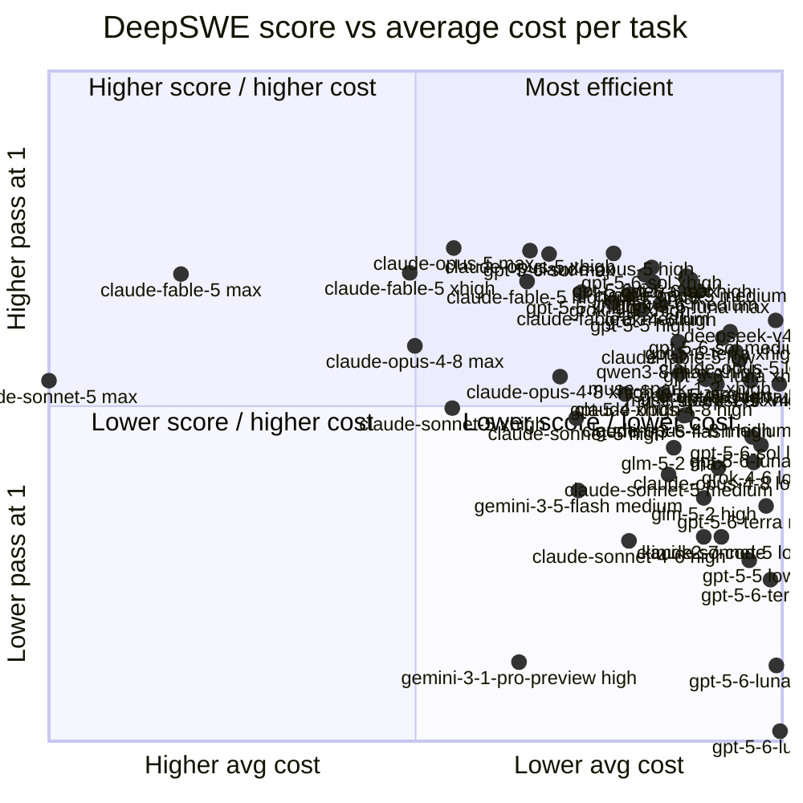
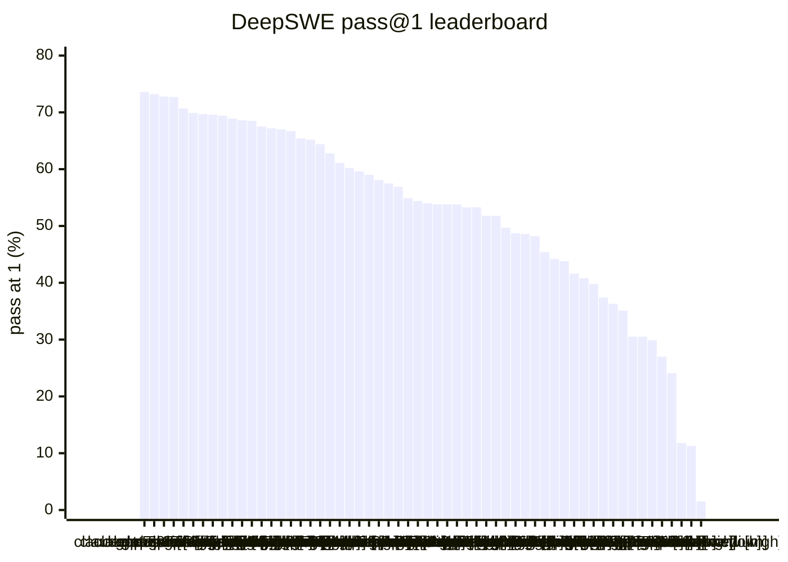

# DeepSWE changelog

This repository tracks changes to the published DeepSWE benchmark results.

> **Original source:** DeepSWE is published by DataCurve at [deepswe.datacurve.ai](https://deepswe.datacurve.ai). Please visit the original site for the canonical benchmark presentation and context.

A scheduled GitHub workflow runs `bun run scrape`, normalizes the public artifact JSON, and commits only when result data changes.

## Charts

### DeepSWE score vs average cost

```mermaid
quadrantChart
    title DeepSWE score vs average cost per task
    x-axis Higher avg cost --> Lower avg cost
    y-axis Lower pass at 1 --> Higher pass at 1
    quadrant-1 Most efficient
    quadrant-2 Higher score / higher cost
    quadrant-3 Lower score / higher cost
    quadrant-4 Lower score / lower cost
    claude-opus-5 max: [0.552, 0.736]
    claude-opus-5 xhigh: [0.656, 0.732]
    claude-opus-5 high: [0.77, 0.728]
    gpt-5-6-sol max: [0.682, 0.727]
    gpt-5-6-sol xhigh: [0.822, 0.707]
    claude-fable-5 xhigh: [0.492, 0.699]
    claude-fable-5 max: [0.18, 0.697]
    gpt-5-6-terra max: [0.813, 0.696]
    gpt-5-6-sol high: [0.869, 0.694]
    claude-opus-5 medium: [0.875, 0.689]
    claude-fable-5 high: [0.652, 0.686]
    kimi-k3 max: [0.824, 0.685]
    grok-4-6 medium: [0.869, 0.675]
    gpt-5-6-luna max: [0.885, 0.672]
    gpt-5-5 xhigh: [0.726, 0.67]
    grok-4-6 xhigh: [0.792, 0.667]
    claude-fable-5 medium: [0.769, 0.654]
    grok-4-6 high: [0.834, 0.652]
    gpt-5-5 high: [0.807, 0.644]
    deepseek-v4-pro max: [0.991, 0.628]
    gpt-5-6-sol medium: [0.929, 0.611]
    gpt-5-6-terra xhigh: [0.919, 0.602]
    claude-fable-5 low: [0.858, 0.596]
    claude-opus-4-8 max: [0.499, 0.59]
    claude-opus-5 low: [0.937, 0.581]
    qwen3-8-max xhigh: [0.859, 0.575]
    gpt-5-6-luna xhigh: [0.942, 0.569]
    muse-spark-1-2 xhigh: [0.86, 0.549]
    claude-opus-4-8 xhigh: [0.697, 0.544]
    gpt-5-5 medium: [0.896, 0.54]
    claude-sonnet-5 max: [0, 0.538]
    gpt-5-6-terra high: [0.957, 0.538]
    grok-4-5 high: [0.908, 0.538]
    deepseek-v4-flash max: [0.996, 0.533]
    muse-spark-1-1 xhigh: [0.911, 0.533]
    claude-opus-4-8 high: [0.838, 0.518]
    gpt-5-4 xhigh: [0.786, 0.518]
    claude-sonnet-5 xhigh: [0.55, 0.497]
    claude-opus-4-8 medium: [0.87, 0.487]
    gemini-3-6-flash high: [0.866, 0.486]
    claude-sonnet-5 high: [0.719, 0.482]
    gpt-5-6-sol low: [0.959, 0.454]
    gpt-5-6-luna high: [0.971, 0.442]
    glm-5-2 max: [0.852, 0.438]
    grok-4-6 low: [0.961, 0.416]
    claude-opus-4-8 low: [0.913, 0.408]
    claude-sonnet-5 medium: [0.845, 0.398]
    gemini-3-5-flash medium: [0.722, 0.374]
    glm-5-2 high: [0.893, 0.363]
    gpt-5-6-terra medium: [0.978, 0.351]
    kimi-k2-7-code: [0.893, 0.305]
    claude-sonnet-5 low: [0.917, 0.305]
    claude-sonnet-4-6 high: [0.791, 0.299]
    gpt-5-5 low: [0.955, 0.27]
    gpt-5-6-terra low: [0.984, 0.241]
    gemini-3-1-pro-preview high: [0.641, 0.118]
    gpt-5-6-luna medium: [0.992, 0.113]
    gpt-5-6-luna low: [0.997, 0.015]
```

### pass@1 leaderboard

```mermaid
xychart-beta
    title "DeepSWE pass@1 leaderboard"
    x-axis ["claude-opus-5 [max]", "claude-opus-5 [xhigh]", "claude-opus-5 [high]", "gpt-5-6-sol [max]", "gpt-5-6-sol [xhigh]", "claude-fable-5 [xhigh]", "claude-fable-5 [max]", "gpt-5-6-terra [max]", "gpt-5-6-sol [high]", "claude-opus-5 [medium]", "claude-fable-5 [high]", "kimi-k3 [max]", "grok-4-6 [medium]", "gpt-5-6-luna [max]", "gpt-5-5 [xhigh]", "grok-4-6 [xhigh]", "claude-fable-5 [medium]", "grok-4-6 [high]", "gpt-5-5 [high]", "deepseek-v4-pro [max]", "gpt-5-6-sol [medium]", "gpt-5-6-terra [xhigh]", "claude-fable-5 [low]", "claude-opus-4-8 [max]", "claude-opus-5 [low]", "qwen3-8-max [xhigh]", "gpt-5-6-luna [xhigh]", "muse-spark-1-2 [xhigh]", "claude-opus-4-8 [xhigh]", "gpt-5-5 [medium]", "claude-sonnet-5 [max]", "gpt-5-6-terra [high]", "grok-4-5 [high]", "deepseek-v4-flash [max]", "muse-spark-1-1 [xhigh]", "claude-opus-4-8 [high]", "gpt-5-4 [xhigh]", "claude-sonnet-5 [xhigh]", "claude-opus-4-8 [medium]", "gemini-3-6-flash [high]", "claude-sonnet-5 [high]", "gpt-5-6-sol [low]", "gpt-5-6-luna [high]", "glm-5-2 [max]", "grok-4-6 [low]", "claude-opus-4-8 [low]", "claude-sonnet-5 [medium]", "gemini-3-5-flash [medium]", "glm-5-2 [high]", "gpt-5-6-terra [medium]", "kimi-k2-7-code", "claude-sonnet-5 [low]", "claude-sonnet-4-6 [high]", "gpt-5-5 [low]", "gpt-5-6-terra [low]", "gemini-3-1-pro-preview [high]", "gpt-5-6-luna [medium]", "gpt-5-6-luna [low]"]
    y-axis "pass at 1 (%)" 0 --> 80
    bar [73.6, 73.2, 72.8, 72.7, 70.7, 69.9, 69.7, 69.6, 69.4, 68.9, 68.6, 68.5, 67.5, 67.2, 67.0, 66.7, 65.4, 65.2, 64.4, 62.8, 61.1, 60.2, 59.6, 59.0, 58.1, 57.5, 56.9, 54.9, 54.4, 54.0, 53.8, 53.8, 53.8, 53.3, 53.3, 51.8, 51.8, 49.7, 48.7, 48.6, 48.2, 45.4, 44.2, 43.8, 41.6, 40.8, 39.8, 37.4, 36.3, 35.1, 30.5, 30.5, 29.9, 27.0, 24.1, 11.8, 11.3, 1.5]
```

## Leaderboard

| Model | Config | Effort | Pass@1 | Passed | Attempts | Avg cost | Avg steps |
| --- | --- | --- | --- | --- | --- | --- | --- |
| claude-opus-5 | mini_swe_agent_claude_opus_5_max | max | 73.6% | 327 | 444 | $11.84 | 99.04 |
| claude-opus-5 | mini_swe_agent_claude_opus_5_xhigh | xhigh | 73.2% | 327 | 447 | $9.07 | 88.72 |
| claude-opus-5 | mini_swe_agent_claude_opus_5_high | high | 72.8% | 327 | 449 | $6.08 | 72.92 |
| gpt-5-6-sol | mini_swe_agent_gpt_5_6_sol_max | max | 72.7% | 327 | 450 | $8.39 | 61.25 |
| gpt-5-6-sol | mini_swe_agent_gpt_5_6_sol_xhigh | xhigh | 70.7% | 319 | 451 | $4.70 | 44 |
| claude-fable-5 | mini_swe_agent_claude_fable_5_xhigh | xhigh | 69.9% | 316 | 452 | $13.41 | 68.4 |
| claude-fable-5 | mini_swe_agent_claude_fable_5_max | max | 69.7% | 304 | 436 | $21.63 | 88.43 |
| gpt-5-6-terra | mini_swe_agent_gpt_5_6_terra_max | max | 69.6% | 314 | 451 | $4.95 | 75.93 |
| gpt-5-6-sol | mini_swe_agent_gpt_5_6_sol_high | high | 69.4% | 313 | 451 | $3.47 | 36.89 |
| claude-opus-5 | mini_swe_agent_claude_opus_5_medium | medium | 68.9% | 308 | 447 | $3.29 | 52.3 |
| claude-fable-5 | mini_swe_agent_claude_fable_5_high | high | 68.6% | 295 | 430 | $9.18 | 58.74 |
| kimi-k3 | mini_swe_agent_kimi_k3_max | max | 68.5% | 309 | 451 | $4.65 | 97.59 |
| grok-4-6 | mini_swe_agent_grok_4_6_medium | medium | 67.5% | 305 | 452 | $3.45 | 70.29 |
| gpt-5-6-luna | mini_swe_agent_gpt_5_6_luna_max | max | 67.2% | 301 | 448 | $3.03 | 101.68 |
| gpt-5-5 | mini_swe_agent_gpt_5_5_xhigh | xhigh | 67.0% | 303 | 452 | $7.23 | 82.02 |
| grok-4-6 | mini_swe_agent_grok_4_6_xhigh | xhigh | 66.7% | 301 | 451 | $5.50 | 87.22 |
| claude-fable-5 | mini_swe_agent_claude_fable_5_medium | medium | 65.4% | 285 | 436 | $6.09 | 48.37 |
| grok-4-6 | mini_swe_agent_grok_4_6_high | high | 65.2% | 294 | 451 | $4.38 | 78.96 |
| gpt-5-5 | mini_swe_agent_gpt_5_5_high | high | 64.4% | 291 | 452 | $5.10 | 61.92 |
| deepseek-v4-pro | mini_swe_agent_deepseek_v4_pro_max | max | 62.8% | 284 | 452 | $0.24 | 154.71 |
| gpt-5-6-sol | mini_swe_agent_gpt_5_6_sol_medium | medium | 61.1% | 276 | 452 | $1.86 | 30.91 |
| gpt-5-6-terra | mini_swe_agent_gpt_5_6_terra_xhigh | xhigh | 60.2% | 272 | 452 | $2.13 | 43.07 |
| claude-fable-5 | mini_swe_agent_claude_fable_5_low | low | 59.6% | 258 | 433 | $3.76 | 37.8 |
| claude-opus-4-8 | mini_swe_agent_claude_opus_4_8_max | max | 59.0% | 253 | 429 | $13.22 | 120 |
| claude-opus-5 | mini_swe_agent_claude_opus_5_low | low | 58.1% | 261 | 449 | $1.66 | 35.64 |
| qwen3-8-max | mini_swe_agent_qwen3_8_max_xhigh | xhigh | 57.5% | 258 | 449 | $3.73 | 111.34 |
| gpt-5-6-luna | mini_swe_agent_gpt_5_6_luna_xhigh | xhigh | 56.9% | 257 | 452 | $1.54 | 71.1 |
| muse-spark-1-2 | mini_swe_agent_muse_spark_1_2_xhigh | xhigh | 54.9% | 248 | 452 | $3.70 | 100.76 |
| claude-opus-4-8 | mini_swe_agent_claude_opus_4_8_xhigh | xhigh | 54.4% | 243 | 447 | $8.01 | 94.64 |
| gpt-5-5 | mini_swe_agent_gpt_5_5_medium | medium | 54.0% | 244 | 452 | $2.75 | 45.98 |
| claude-sonnet-5 | mini_swe_agent_claude_sonnet_5_max | max | 53.8% | 238 | 442 | $26.40 | 268.45 |
| gpt-5-6-terra | mini_swe_agent_gpt_5_6_terra_high | high | 53.8% | 243 | 452 | $1.13 | 33.51 |
| grok-4-5 | mini_swe_agent_grok_4_5_high | high | 53.8% | 243 | 452 | $2.42 | 61.33 |
| deepseek-v4-flash | mini_swe_agent_deepseek_v4_flash_max | max | 53.3% | 241 | 452 | $0.10 | 152.88 |
| muse-spark-1-1 | mini_swe_agent_muse_spark_1_1_xhigh | xhigh | 53.3% | 241 | 452 | $2.36 | 95.83 |
| claude-opus-4-8 | mini_swe_agent_claude_opus_4_8_high | high | 51.8% | 234 | 452 | $4.28 | 72.5 |
| gpt-5-4 | mini_swe_agent_gpt_5_4_xhigh | xhigh | 51.8% | 234 | 452 | $5.65 | 70.47 |
| claude-sonnet-5 | mini_swe_agent_claude_sonnet_5_xhigh | xhigh | 49.7% | 224 | 451 | $11.89 | 185.53 |
| claude-opus-4-8 | mini_swe_agent_claude_opus_4_8_medium | medium | 48.7% | 220 | 452 | $3.44 | 65.57 |
| gemini-3-6-flash | mini_swe_agent_gemini_3_6_flash_high | high | 48.6% | 219 | 451 | $3.53 | 108.31 |
| claude-sonnet-5 | mini_swe_agent_claude_sonnet_5_high | high | 48.2% | 218 | 452 | $7.43 | 146.58 |
| gpt-5-6-sol | mini_swe_agent_gpt_5_6_sol_low | low | 45.4% | 205 | 452 | $1.07 | 23.36 |
| gpt-5-6-luna | mini_swe_agent_gpt_5_6_luna_high | high | 44.2% | 200 | 452 | $0.78 | 49.02 |
| glm-5-2 | mini_swe_agent_glm_5_2_max | max | 43.8% | 197 | 450 | $3.92 | 129.13 |
| grok-4-6 | mini_swe_agent_grok_4_6_low | low | 41.6% | 187 | 449 | $1.04 | 44.19 |
| claude-opus-4-8 | mini_swe_agent_claude_opus_4_8_low | low | 40.8% | 184 | 451 | $2.29 | 53.98 |
| claude-sonnet-5 | mini_swe_agent_claude_sonnet_5_medium | medium | 39.8% | 179 | 450 | $4.08 | 107.61 |
| gemini-3-5-flash | mini_swe_agent_gemini_3_5_flash_medium | medium | 37.4% | 169 | 452 | $7.34 | 85.72 |
| glm-5-2 | mini_swe_agent_glm_5_2_high | high | 36.3% | 164 | 452 | $2.84 | 121.88 |
| gpt-5-6-terra | mini_swe_agent_gpt_5_6_terra_medium | medium | 35.1% | 158 | 450 | $0.58 | 25.15 |
| kimi-k2-7-code | mini_swe_agent_kimi_k2_7_code_default |  | 30.5% | 138 | 452 | $2.82 | 149.12 |
| claude-sonnet-5 | mini_swe_agent_claude_sonnet_5_low | low | 30.5% | 137 | 449 | $2.19 | 76.89 |
| claude-sonnet-4-6 | mini_swe_agent_claude_sonnet_4_6_high | high | 29.9% | 135 | 451 | $5.52 | 133.66 |
| gpt-5-5 | mini_swe_agent_gpt_5_5_low | low | 27.0% | 122 | 452 | $1.20 | 28.07 |
| gpt-5-6-terra | mini_swe_agent_gpt_5_6_terra_low | low | 24.1% | 108 | 449 | $0.43 | 21.46 |
| gemini-3-1-pro-preview | mini_swe_agent_gemini_3_1_pro_preview_high | high | 11.8% | 53 | 451 | $9.48 | 81.39 |
| gpt-5-6-luna | mini_swe_agent_gpt_5_6_luna_medium | medium | 11.3% | 51 | 452 | $0.22 | 23.68 |
| gpt-5-6-luna | mini_swe_agent_gpt_5_6_luna_low | low | 1.5% | 7 | 452 | $0.07 | 12.46 |

See [the full generated data report](data/README.md) for release metadata, v1.1 delta, task coverage, and raw snapshot links.
